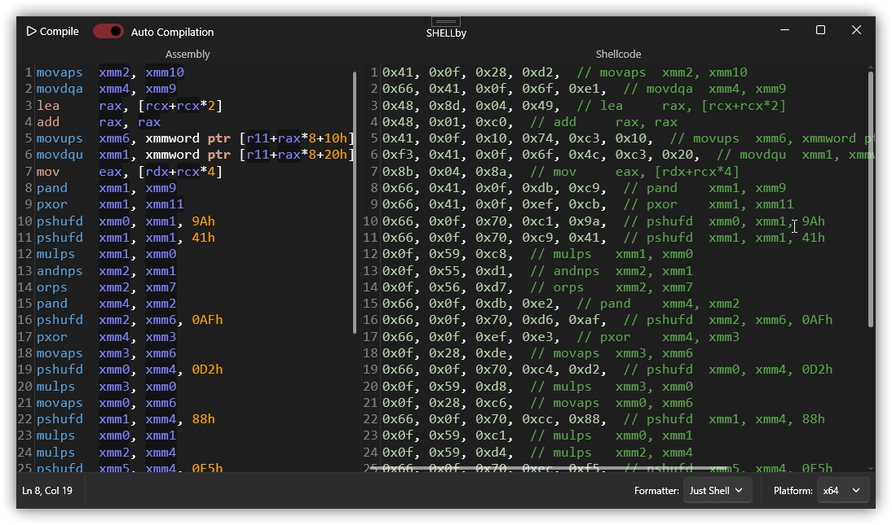

  

# SHELLby

### Small handy tool for crafting shellcodes by hand. Built on top [keystone engine](https://github.com/keystone-engine/keystone).

## Features
- Automatic compilation
- Syntax highlighting
- Multiple formatters
    - C#
    - C++
    - Python
- Platforms
    - x86 (32Bit and 64Bit)

## Download
Latest build binary is always on Release page. You can get it there.

## Future plans (?)
- Autocomplete with description for all instructions 
- More code formatters
- Symbolic Execution

